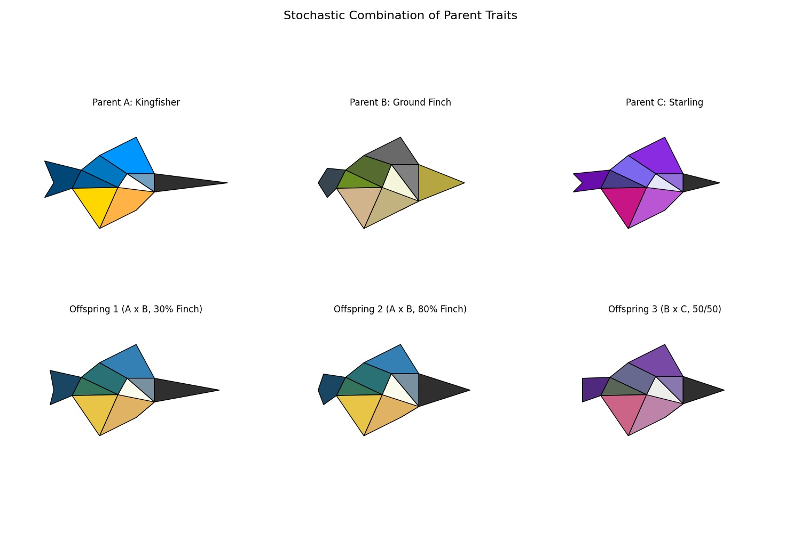
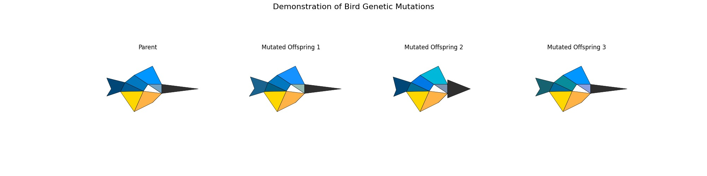

# Bird Appearance Mechanics

The visual appearance of each bird in the simulation is not random; it is determined by a set of "genes" that are inherited, blended, and mutated across generations. This genetic system is defined in [`js/presets.js`](js/presets.js:100) and implemented in [`js/main.js`](js/main.js:143).

## Genetic Components (`BIRD_GENES`)

A bird's appearance is defined by a combination of shapes and colors stored in [`BIRD_GENES`](js/presets.js:100).

1.  **Body Shapes:** These are predefined sets of vertices that form the main body of the bird. The simulation includes a `STANDARD` and `CRACKER` body type.

2.  **Beak & Tail Shapes:**
    -   **Beaks** are also sets of vertices. Each beak shape is designed to connect seamlessly to a specific body shape.
    -   **Tails** are defined as *functions*. A tail function takes the bird's body vertices as input and calculates the correct tail vertices, guaranteeing that the tail always connects perfectly to the body, regardless of how the body shape evolves.

3.  **Color Palettes:** These are objects that map specific body parts (e.g., `head_crest`, `wing_top`) to hexadecimal color codes. The simulation includes several predefined palettes like `CLASSIC` and `EARTHY`.

## Inheritance and Blending (`determineInheritance` function)

When two birds reproduce, their offspring's appearance is a blend of their parents' genes.

1.  **Shape Interpolation:** An offspring's body, beak, and tail vertices are not simply chosen from one parent. Instead, they are calculated by **interpolating** between the vertex positions of parent 1 and parent 2. A random `weight` determines the influence of each parent, allowing for an infinite spectrum of shapes between the two parents.

2.  **Color Blending:** The offspring's color palette is created by taking each color from the parents' palettes (e.g., the `wing_top` color) and computationally blending them to find the average color.

    

## Mutation

While inheritance and blending create new combinations of traits, mutation introduces entirely new variations into the gene pool. A small, random mutation is applied to the offspring's genes, which can result in novel shapes or colors not present in either parent. This allows for the evolution of new appearances over time.

## Drawing the Bird Model

The final appearance is rendered through a multi-step process in [`js/boids/drawing.js`](js/boids/drawing.js:1):

1.  **[`drawBirdModel`](js/boids/drawing.js:3):** This core function defines the bird's geometry.
    *   It constructs a series of closed polygons (e.g., `head_crest`, `wing_bottom`) using the vertex data from the bird's genes.
    *   Each polygon is filled with the corresponding color from the bird's genetic palette.

2.  **[`preRenderBird`](js/boids/drawing.js:34):** For efficiency, each bird's appearance is pre-rendered to an offscreen canvas once.
    *   This function calls `drawBirdModel` to draw the static bird shape onto a temporary canvas.
    *   This pre-rendered image is stored on the boid object.

3.  **[`drawBird`](js/boids/drawing.js:54):** In each animation frame, this function draws the final bird onto the main canvas.
    *   It takes the pre-rendered canvas image.
    *   The image is translated to the bird's current position, rotated to face its direction of travel, and scaled appropriately. If the bird is not alive, it is drawn rotated on its side and fades out.

This system allows for a rich and visually diverse population of birds, where every individual can be subtly or dramatically unique, while maintaining high performance by avoiding redrawing the complex model every frame.
