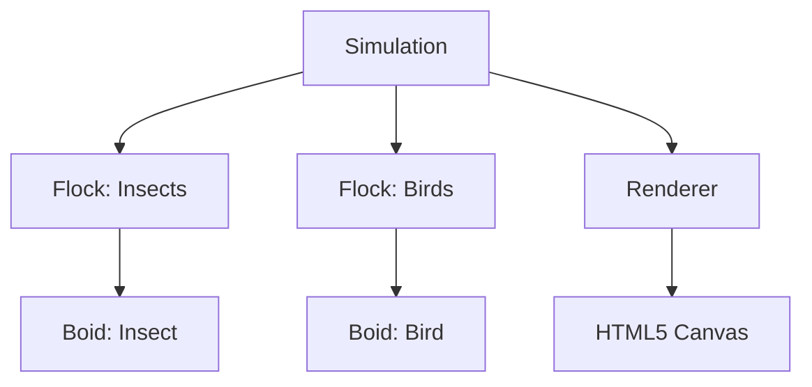

# Boids Simulation: Planning and Architecture

## 1. Introduction

This document outlines the planning and architecture for a JavaScript-based Boids simulation. The project's goal is to create a visually engaging simulation of flocking behavior with two distinct types of agents: insects and birds. The insects will exhibit standard flocking behavior, while the birds will form their own flock and actively hunt the insects, introducing a predator-prey dynamic to the classic Boids algorithm.

## 2. Core Concepts

The simulation is based on the Boids algorithm, which simulates the flocking behavior of birds. Each "boid" in the simulation follows a set of simple rules, which, when applied to a group, result in complex, emergent behavior that mimics natural flocks.

The three core rules of the Boids algorithm are:

*   **Cohesion:** Each boid steers to move toward the average position of its local flockmates. This rule keeps the flock together.
*   **Separation:** Each boid steers to avoid crowding its local flockmates. This rule prevents boids from colliding with each other.
*   **Alignment:** Each boid steers toward the average heading (direction and speed) of its local flockmates. This rule makes the flock move in a coordinated manner.

## 3. Simulation-Specific Features

### Two Flocks

The simulation will feature two distinct types of boids, each with its own flock:

*   **Insects:** A flock of boids that follow the three standard Boids rules. They will be the prey in the simulation.
*   **Birds:** A flock of boids that also follow the standard rules but with an additional "hunt" behavior. They will be the predators.

Each flock will be managed independently, with its own set of boids and potentially slightly different parameters for cohesion, separation, and alignment to create distinct movement patterns.

### Hunting Behavior

The hunting behavior of the birds adds a layer of complexity to the simulation:

*   **Targeting:** A bird will scan for the nearest insect within its perception radius. If an insect is found, the bird will apply a steering force toward that insect, making it a target.
*   **Insect Reaction:** Insects will have a "fear" radius. If a bird enters this radius, the insect will have a strong steering force applied to move directly away from the bird, overriding its normal flocking behavior temporarily.
*   **Capture:** If a bird gets close enough to a targeted insect, the insect is considered "eaten" and will be removed from the simulation.

### Boundary Handling

When a boid reaches the edge of the simulation area, it will wrap around to the opposite side. For example, a boid exiting the right side of the screen will reappear on the left side, maintaining its velocity. This creates a continuous, seamless world for the boids.

## 4. Proposed Architecture

### Component Breakdown

The application will be broken down into the following components:

*   **`Boid`:** A class representing a single boid. It will manage its own position, velocity, and acceleration, and will have methods to apply the Boids rules. There will be subclasses for `Insect` and `Bird` to handle their specific behaviors.
*   **`Flock`:** A class to manage a collection of boids. It will be responsible for updating and rendering all the boids within it.
*   **`Simulation`:** The main class that initializes and runs the simulation loop. It will manage the flocks, handle user input, and orchestrate the updates of all simulation elements.
*   **`Renderer`:** A component responsible for drawing the boids and the simulation environment onto the screen.



### Data Structures

*   **Boids:** Each boid will be an object with properties for its position (a 2D vector), velocity (a 2D vector), and other simulation-specific parameters like max speed and max force.
*   **Flocks:** Each flock will be an array of `Boid` objects.
*   **Spatial Partitioning (Optional):** For performance optimization with a large number of boids, a spatial partitioning data structure like a quadtree could be used to speed up the process of finding local flockmates for each boid.

### Rendering

The simulation will be rendered using the **HTML5 Canvas API**. Each boid will be drawn as a simple shape (e.g., a triangle or circle) on the canvas. The `Renderer` will be responsible for clearing the canvas and redrawing all boids in their new positions on each frame of the simulation loop.

## 5. Implementation Plan

### Milestones

1.  **Basic Boid and Vector:** Create a `Vector` class for 2D math and a basic `Boid` class with position, velocity, and update methods.
2.  **Canvas Setup:** Set up the HTML5 canvas and a basic rendering loop.
3.  **Implement Boids Rules:** Implement the cohesion, separation, and alignment rules in the `Boid` class.
4.  **Flock Management:** Create a `Flock` class to manage and update a group of boids.
5.  **Two Flocks:** Instantiate two separate flocks for insects and birds.
6.  **Hunting and Evasion:** Implement the hunting behavior for birds and the evasion behavior for insects.
7.  **UI and Controls:** Add UI elements to control simulation parameters (e.g., number of boids, visual parameters).

### File Structure

A possible file structure for the project:

```
boids-simulation/
├── index.html
├── css/
│   └── style.css
└── js/
    ├── main.js         # Main simulation logic
    ├── boid.js         # Boid class
    ├── flock.js        # Flock class
    └── vector.js       # 2D Vector library